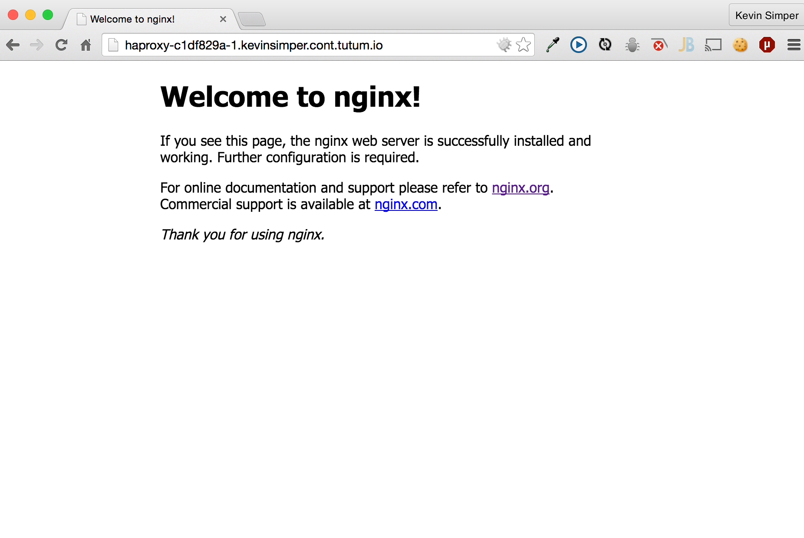

title: Docker Hosting
controls: false
style: style.css

--

# Docker Hosting
## Who can we ship this container?

--

# About me

## @kevinsimper
## Graduateland

--

# Disclaimer
## Not paid reviews!

--

# Do it yourself vs PAAS

--

# Tutum


--

# Orchard


--

# StackDock


--

# Joyent


--

## Okay, lets create a cluster with Tutum

--


--


--


--
```
$ docker pull nginx:latest

$ docker images
REPOSITORY          TAG                 IMAGE ID            CREATED             VIRTUAL SIZE
ubuntu              14.04               5ba9dab47459        2 weeks ago         188.3 MB
ubuntu              14.04.1             5ba9dab47459        2 weeks ago         188.3 MB
ubuntu              latest              5ba9dab47459        2 weeks ago         188.3 MB
ubuntu              trusty              5ba9dab47459        2 weeks ago         188.3 MB
nginx               latest              4b5657a3d162        2 weeks ago         91.66 MB

$ docker tag nginx tutum.co/kevinsimper/mynginx
$ docker images
REPOSITORY                     TAG                 IMAGE ID            CREATED             VIRTUAL SIZE
ubuntu                         14.04               5ba9dab47459        2 weeks ago         188.3 MB
ubuntu                         14.04.1             5ba9dab47459        2 weeks ago         188.3 MB
ubuntu                         latest              5ba9dab47459        2 weeks ago         188.3 MB
ubuntu                         trusty              5ba9dab47459        2 weeks ago         188.3 MB
nginx                          latest              4b5657a3d162        2 weeks ago         91.66 MB
tutum.co/kevinsimper/mynginx   latest              4b5657a3d162        2 weeks ago         91.66 MB
hello-world                    latest              e45a5af57b00        6 weeks ago         910 B
```
--
```
$ docker login tutum.co
Username: kevinsimper
Password:
Email: kevin.simper@gmail.com
Login Succeeded

$ docker push tutum.co/kevinsimper/mynginx
The push refers to a repository [tutum.co/kevinsimper/mynginx] (len: 1)
Sending image list
Pushing repository tutum.co/kevinsimper/mynginx (1 tags)
Image d9ee0b8eeda7 already pushed, skipping
Image 3225d58a895a already pushed, skipping
Image 30d39e59ffe2 already pushed, skipping
Image 511136ea3c5a already pushed, skipping
Image c90d655b99b2 already pushed, skipping
Image 224fea58b6cc already pushed, skipping
Image f22d05624ebc already pushed, skipping
Image ef9d79968cc6 already pushed, skipping
Image 117696d1464e already pushed, skipping
Image 2ebe3e67fb76 already pushed, skipping
Image ad82b43d6595 already pushed, skipping
Image e90c322c3a1c already pushed, skipping
Image 4b5657a3d162 already pushed, skipping
Pushing tag for rev [4b5657a3d162] on {https://tutum.co/v1/repositories/kevinsimper/mynginx/tags/latest}
```
--

--

--

--

--

--

--

--

--

--
# Load Balancing?
## Tutum Haproxy 
https://github.com/tutumcloud/tutum-docker-clusterproxy
--

--

--

--

--

--