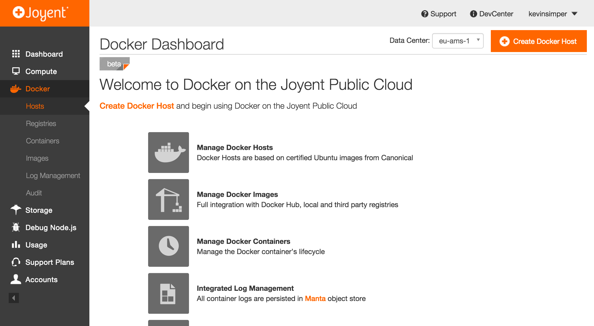
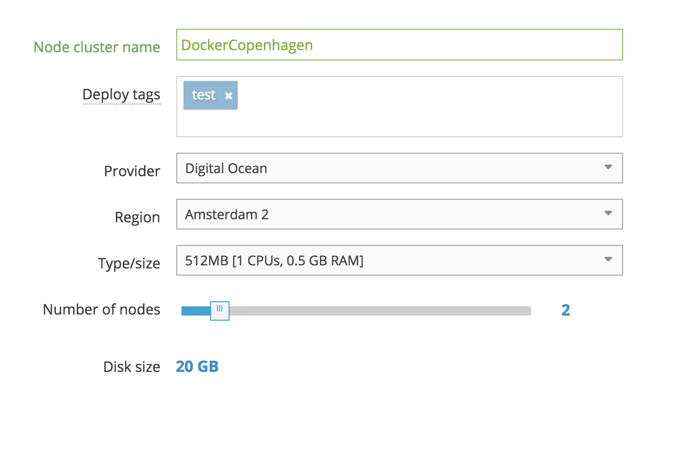
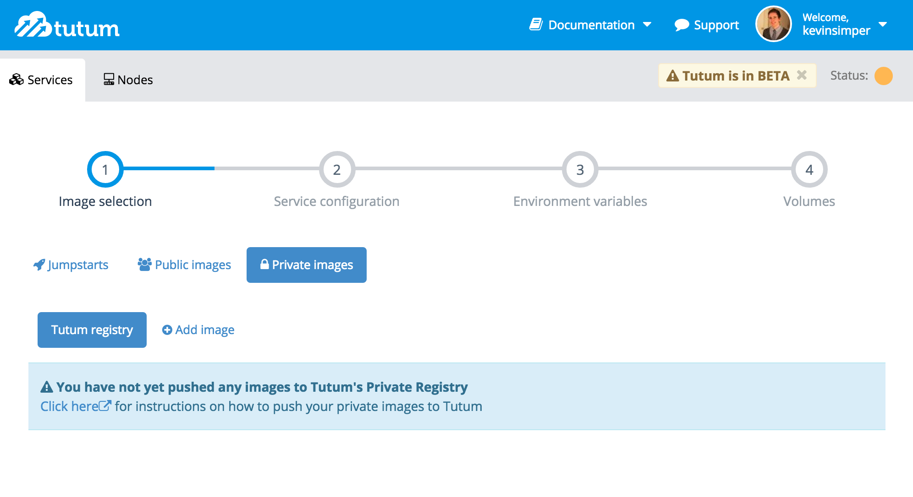
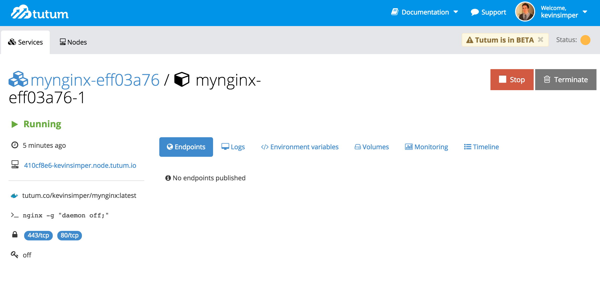
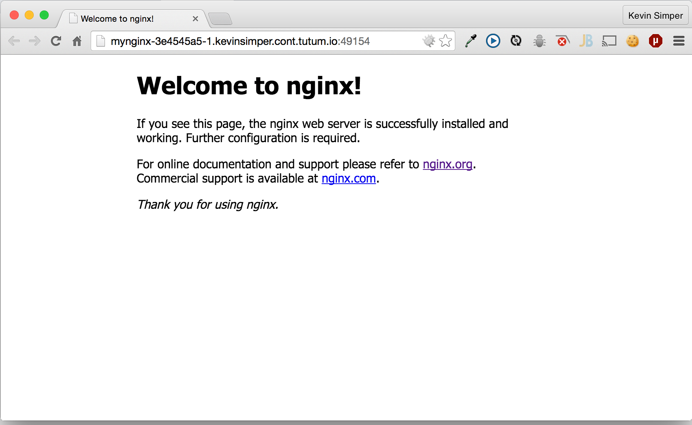

title: Docker Hosting
controls: false
style: style.css

--

# Docker Hosting
## Who can we ship this container?

--

# About me

## @kevinsimper
## Graduateland

--

# Disclaimer
## Not paid reviews!

--

# Do it yourself vs PAAS

--

# Tutum


--

# Orchard


--

# StackDock


--

# Joyent



--

## Okay, lets create a cluster with Tutum

--



--


--



--
```
$ docker pull nginx:latest

$ docker images
REPOSITORY          TAG                 IMAGE ID            CREATED             VIRTUAL SIZE
ubuntu              14.04               5ba9dab47459        2 weeks ago         188.3 MB
ubuntu              14.04.1             5ba9dab47459        2 weeks ago         188.3 MB
ubuntu              latest              5ba9dab47459        2 weeks ago         188.3 MB
ubuntu              trusty              5ba9dab47459        2 weeks ago         188.3 MB
nginx               latest              4b5657a3d162        2 weeks ago         91.66 MB

$ docker tag nginx tutum.co/kevinsimper/mynginx
$ docker images
REPOSITORY                     TAG                 IMAGE ID            CREATED             VIRTUAL SIZE
ubuntu                         14.04               5ba9dab47459        2 weeks ago         188.3 MB
ubuntu                         14.04.1             5ba9dab47459        2 weeks ago         188.3 MB
ubuntu                         latest              5ba9dab47459        2 weeks ago         188.3 MB
ubuntu                         trusty              5ba9dab47459        2 weeks ago         188.3 MB
nginx                          latest              4b5657a3d162        2 weeks ago         91.66 MB
tutum.co/kevinsimper/mynginx   latest              4b5657a3d162        2 weeks ago         91.66 MB
hello-world                    latest              e45a5af57b00        6 weeks ago         910 B
```
--
```
$ docker login tutum.co
Username: kevinsimper
Password:
Email: kevin.simper@gmail.com
Login Succeeded

$ docker push tutum.co/kevinsimper/mynginx
The push refers to a repository [tutum.co/kevinsimper/mynginx] (len: 1)
Sending image list
Pushing repository tutum.co/kevinsimper/mynginx (1 tags)
Image d9ee0b8eeda7 already pushed, skipping
Image 3225d58a895a already pushed, skipping
Image 30d39e59ffe2 already pushed, skipping
Image 511136ea3c5a already pushed, skipping
Image c90d655b99b2 already pushed, skipping
Image 224fea58b6cc already pushed, skipping
Image f22d05624ebc already pushed, skipping
Image ef9d79968cc6 already pushed, skipping
Image 117696d1464e already pushed, skipping
Image 2ebe3e67fb76 already pushed, skipping
Image ad82b43d6595 already pushed, skipping
Image e90c322c3a1c already pushed, skipping
Image 4b5657a3d162 already pushed, skipping
Pushing tag for rev [4b5657a3d162] on {https://tutum.co/v1/repositories/kevinsimper/mynginx/tags/latest}
```
--

--

--

--

--

--

--

--

--

--
# Load Balancing?
## Tutum Haproxy 
https://github.com/tutumcloud/tutum-docker-clusterproxy
--

--

--

--

--

--
# tutum cli
## works, but implicit
--
# What else is there?
--
# docker machine & docker swarm
--
## First we need some machines
# Docker machine
--
## download and install 
## docker machine to your path
--
```bash
$ docker-machine create -d digitalocean --digitalocean-access-token ${DIGITAL_OCEAN} node01
INFO[0000] Creating SSH key...
INFO[0001] Creating Digital Ocean droplet...
INFO[0005] Waiting for SSH...
+ [ https://get.docker.com/ = https://get.docker.com/ ]
+ sh -c apt-key adv --keyserver hkp://keyserver.ubuntu.com:80 --recv-keys 36A1D7869245C8950F966E92D8576A8BA88D21E9
gpg: requesting key A88D21E9 from hkp server keyserver.ubuntu.com
gpg: key A88D21E9: public key "Docker Release Tool (releasedocker) <docker@dotcloud.com>" imported
gpg: Total number processed: 1
gpg:               imported: 1  (RSA: 1)
+ sh -c echo deb https://get.docker.com/ubuntu docker main > /etc/apt/sources.list.d/docker.list
+ sh -c sleep 3; apt-get update; apt-get install -y -q lxc-docker
+ sh -c docker version
INFO[0132] "node01" has been created and is now the active machine
INFO[0132] To connect: docker $(docker-machine config node01) ps
kevinsimper$ docker $(docker-machine config node01) ps
CONTAINER ID        IMAGE               COMMAND             CREATED             STATUS              PORTS               NAMES
```
--
```
$ docker-machine ls
NAME     ACTIVE   DRIVER         STATE     URL
node01   *        digitalocean   Running   tcp://104.131.178.98:2376
```
--
```
$ docker-machine ssh
Welcome to Ubuntu 14.04.1 LTS (GNU/Linux 3.13.0-43-generic x86_64)

 * Documentation:  https://help.ubuntu.com/

  System information as of Tue Feb 17 03:47:41 EST 2015

  System load:  0.01               Processes:              68
  Usage of /:   11.4% of 19.56GB   Users logged in:        0
  Memory usage: 13%                IP address for eth0:    104.131.178.98
  Swap usage:   0%                 IP address for docker0: 172.17.42.1

  Graph this data and manage this system at:
    https://landscape.canonical.com/

Last login: Tue Feb 17 03:47:41 2015 from 62-135-247-12-dynamic.dk.customer.tdc.net
root@node01:~#
```
--
## works like coreos _etcd_
```
$ docker run --rm swarm create
Unable to find image 'swarm:latest' locally
a8bbe4db330c: Pull complete
9dfb95669acc: Pull complete
0b3950daf974: Pull complete
633f3d9a9685: Pull complete
bba5f98a0414: Pull complete
defbc1ab4462: Pull complete
92d78d321ff2: Pull complete
511136ea3c5a: Already exists
swarm:latest: The image you are pulling has been verified. Important: image verification is a tech preview feature and should not be relied on to provide security.
Status: Downloaded newer image for swarm:latest
1759275a913132d137a80afd6a929836
```
--
```
docker run -d swarm join --addr=104.131.178.98:2375 token://1759275a913132d137a80afd6a929836

docker run -t -p 104.131.6.53::2375 swarm manage token://1759275a913132d137a80afd6a929836
```
```
docker -H tcp://<swarm_ip:swarm_port> info
```
--
```
$ docker ps
CONTAINER ID        IMAGE               COMMAND             CREATED                  STATUS              PORTS                           NODE        NAMES
92d78d321ff2        mynginx:latest      "nginx"             Less than a second ago   running             104.131.178.98:49178->80/tcp    node-01     mynginx
```
--
## rough edges
- takes time
- docker listening on network
- loadbalacing
--
# deis.io
## your own paas
--
## mimicking heroku functionality and cli

## $ deis apps:create
## $ deis apps:list
## $ git push deis master
--
```
$ git push deis master
Counting objects: 13, done.
Delta compression using up to 8 threads.
Compressing objects: 100% (13/13), done.
Writing objects: 100% (13/13), 1.99 KiB | 0 bytes/s, done.
Total 13 (delta 2), reused 0 (delta 0)
======> Building Docker image

```
--
## Setting up deis
## 45 minutes
--
## $ brew install deisctl
--
## deis + coreos
* has cloudinit/userdata for all providers

```
$ git clone https://github.com/deis/deis.git && cd deis

$ make discovery-url

```
--
```
$ gem install docl
$ docl authorize
$ docl upload_key deis ~/.ssh/deis.pub
$ # retrieve your SSH key's ID
$ docl keys
deis (id: 690051)
$ # retrieve the region name
$ docl regions --metadata --private-networking
Amsterdam 2 (ams2)
Amsterdam 3 (ams3)
London 1 (lon1)
New York 3 (nyc3)
Singapore 1 (sgp1)
$ ./contrib/digitalocean/provision-do-cluster.sh ams2 690051 4GB
```
--
```
$ export DEISCTL_TUNNEL=178.62.236.61
$ deisctl config platform set sshPrivateKey=~/.ssh/deis
```
--
```
$ deisctl install platform
● ▴ ■
■ ● ▴ Installing Deis...
▴ ■ ●

Storage subsystem...
deis-store-daemon.service: loaded
deis-store-monitor.service: loaded
deis-store-gateway.service: loaded
deis-store-volume.service: loaded
deis-store-metadata.service: loaded
Logging subsystem...
deis-logspout.service: loaded
deis-logger.service: loaded
Control plane...
deis-database.service: loaded
deis-controller.service: loaded
deis-cache.service: loaded
deis-registry@1.service: loaded
deis-builder.service: loaded
Data plane...
deis-publisher.service: loaded
Routing mesh...
deis-router@1.service: loaded
deis-router@3.service: loaded
deis-router@2.service: loaded
Done.

Please run `deisctl start platform` to boot up Deis.
```
--

```
deisctl start platform
● ▴ ■
■ ● ▴ Starting Deis...
▴ ■ ●

Storage subsystem...
deis-store-monitor.service: activating/start-pre
deis-store-monitor.service: active/running
deis-store-daemon.service: activating/start-pre
deis-store-daemon.service: active/running
deis-store-metadata.service: activating/start-pre
deis-store-metadata.service: active/running
deis-store-gateway.service: activating/start-pre
deis-store-gateway.service: activating/start-post
deis-store-gateway.service: active/running
deis-store-volume.service: active/running
Logging subsystem...
deis-logger.service: activating/start-pre
deis-logger.service: active/running
deis-logspout.service: activating/start-pre
deis-logspout.service: active/running
Control plane...
deis-database.service: activating/start-pre
deis-registry@1.service: activating/start-pre
deis-controller.service: activating/start-pre
deis-cache.service: activating/start-pre
deis-cache.service: active/running
deis-database.service: active/running
deis-registry@1.service: active/running
deis-controller.service: active/running
deis-builder.service: activating/start-post
deis-builder.service: active/running
Data plane...
deis-publisher.service: active/running
Routing mesh...
deis-router@1.service: active/running
deis-router@2.service: active/running
deis-router@3.service: active/running
Done.

Please use `deis register` to setup an administrator account.
```
--
```
deisctl list
UNIT        MACHINE       LOAD  ACTIVE  SUB
deis-builder.service    50e09e48.../10.133.218.102  loaded  active  running
deis-cache.service    dd805855.../10.133.194.30 loaded  active  running
deis-controller.service   50e09e48.../10.133.218.102  loaded  active  running
deis-database.service   5a290776.../10.133.218.103  loaded  active  running
deis-logger.service   5a290776.../10.133.218.103  loaded  active  running
deis-logspout.service   50e09e48.../10.133.218.102  loaded  active  running
deis-logspout.service   5a290776.../10.133.218.103  loaded  active  running
deis-logspout.service   dd805855.../10.133.194.30 loaded  active  running
deis-publisher.service    50e09e48.../10.133.218.102  loaded  active  running
deis-publisher.service    5a290776.../10.133.218.103  loaded  active  running
deis-publisher.service    dd805855.../10.133.194.30 loaded  active  running
deis-registry@1.service   dd805855.../10.133.194.30 loaded  active  running
deis-router@1.service   5a290776.../10.133.218.103  loaded  active  running
deis-router@2.service   dd805855.../10.133.194.30 loaded  active  running
deis-router@3.service   50e09e48.../10.133.218.102  loaded  active  running
deis-store-daemon.service 50e09e48.../10.133.218.102  loaded  active  running
deis-store-daemon.service 5a290776.../10.133.218.103  loaded  active  running
deis-store-daemon.service dd805855.../10.133.194.30 loaded  active  running
deis-store-gateway.service  50e09e48.../10.133.218.102  loaded  active  running
deis-store-metadata.service 50e09e48.../10.133.218.102  loaded  active  running
deis-store-metadata.service 5a290776.../10.133.218.103  loaded  active  running
deis-store-metadata.service dd805855.../10.133.194.30 loaded  active  running
deis-store-monitor.service  50e09e48.../10.133.218.102  loaded  active  running
deis-store-monitor.service  5a290776.../10.133.218.103  loaded  active  running
deis-store-monitor.service  dd805855.../10.133.194.30 loaded  active  running
deis-store-volume.service 50e09e48.../10.133.218.102  loaded  active  running
deis-store-volume.service 5a290776.../10.133.218.103  loaded  active  running
deis-store-volume.service dd805855.../10.133.194.30 loaded  active  running
```
--
## install _deis_ terminal
## curl -sSL http://deis.io/deis-cli/install.sh | sh
--
```
$ deis register deis.app.dockercph.dk
username: kevinsimper
password:
password (confirm):
email: kevin.simper@gmail.com
Registered kevinsimper
Logged in as kevinsimper
``
--
```
git clone https://github.com/kevinsimper/node-server-docker-example
```
--
```
$ ls -lF
total 24
-rw-rw-r--  1 kevinsimper  staff   84 Feb 17 14:23 Dockerfile
-rw-r--r--  1 kevinsimper  staff   76 Feb 17 14:02 README.md
-rw-rw-r--  1 kevinsimper  staff  163 Feb 17 14:05 app.js
```
--
```
$ deis apps:create
$ deis keys:add
$ git push deis master
```
--

```
$ git push deis master
Counting objects: 8, done.
Delta compression using up to 8 threads.
Compressing objects: 100% (8/8), done.
Writing objects: 100% (8/8), 1.19 KiB | 0 bytes/s, done.
Total 8 (delta 0), reused 0 (delta 0)

=====> Building Docker image
remote: build context to Docker daemon 6.144 kB
remote: build context to Docker daemon
Step 0 : FROM node:latest
Pulling repository node
Status: Downloaded newer image for node:latest
 ===> 12f018678fb1
Step 1 : ADD app.js /app/app.js
 ===> 73947ffaab84
Removing intermediate container 199b42aafdec
Step 2 : WORKDIR /app
 ===> Running in 0856bf865d39
 ===> 16b0227a3700
Removing intermediate container 0856bf865d39
Step 3 : CMD node app.js
 ===> Running in 9438a29dbec1
 ===> de04e58ea47a
Removing intermediate container 9438a29dbec1
Step 4 : EXPOSE 9000
 ===> Running in 63eb75487fbf
 ===> ad732a778bf7
Removing intermediate container 63eb75487fbf
Step 5 : ENV GIT_SHA 67b5156b3e8148ad1f049afb9018a74276cd75fe
 ===> Running in 1779a2dafa30
 ===> 17921dd650e9
Removing intermediate container 1779a2dafa30
Successfully built 17921dd650e9
=====> Pushing image to private registry

=====> Launching...
       done, padded-fireball:v2 deployed to Deis

       http://padded-fireball.app.dockercph.com

       To learn more, use `deis help` or visit http://deis.io

To ssh://git@deis.app.dockercph.dk:2222/padded-fireball.git
 * [new branch]      master -> master
```
--

--
```
$ mkdir ~/mynginx && cd ~/mynginx
$ deis create
$ deis pull kevinsimper/node-server-example:latest
Creating build... done, v1
```
http://mynginx.app.dockercph.dk/
--
## scale

```
deis scale cmd=4
Scaling processes... but first, coffee!
done in 94s
=== mynginx Processes

=== cmd:
cmd.1 up (v4)
cmd.2 up (v4)
cmd.3 up (v4)
cmd.4 up (v4)
```

--
# summary
## young community
## do it yourself
## lots of possibilties
## no solution for all

--
<h1 style="margin:20px 0;">try it yourself!</h1>

## download the `deis` cli
## register against `deis.app.dockercph.dk`

<h2 style="margin-top:80px;">questions?</h1>